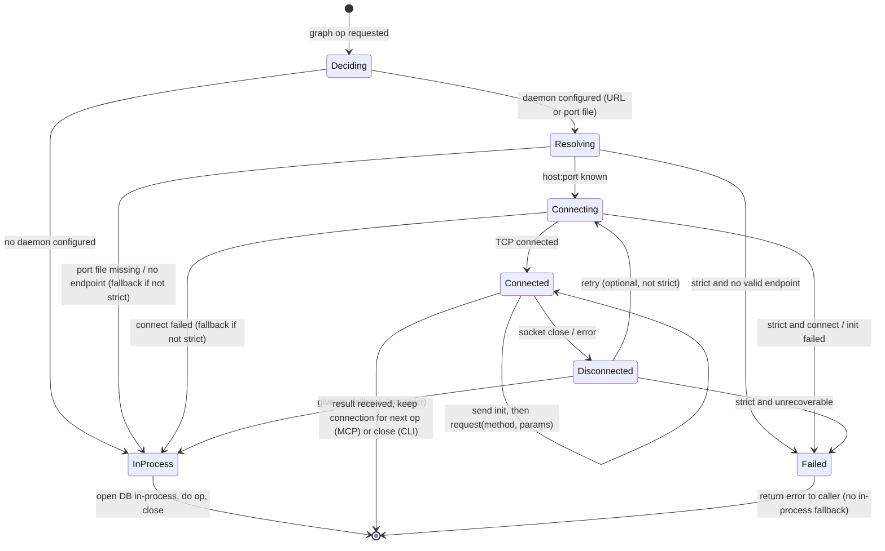
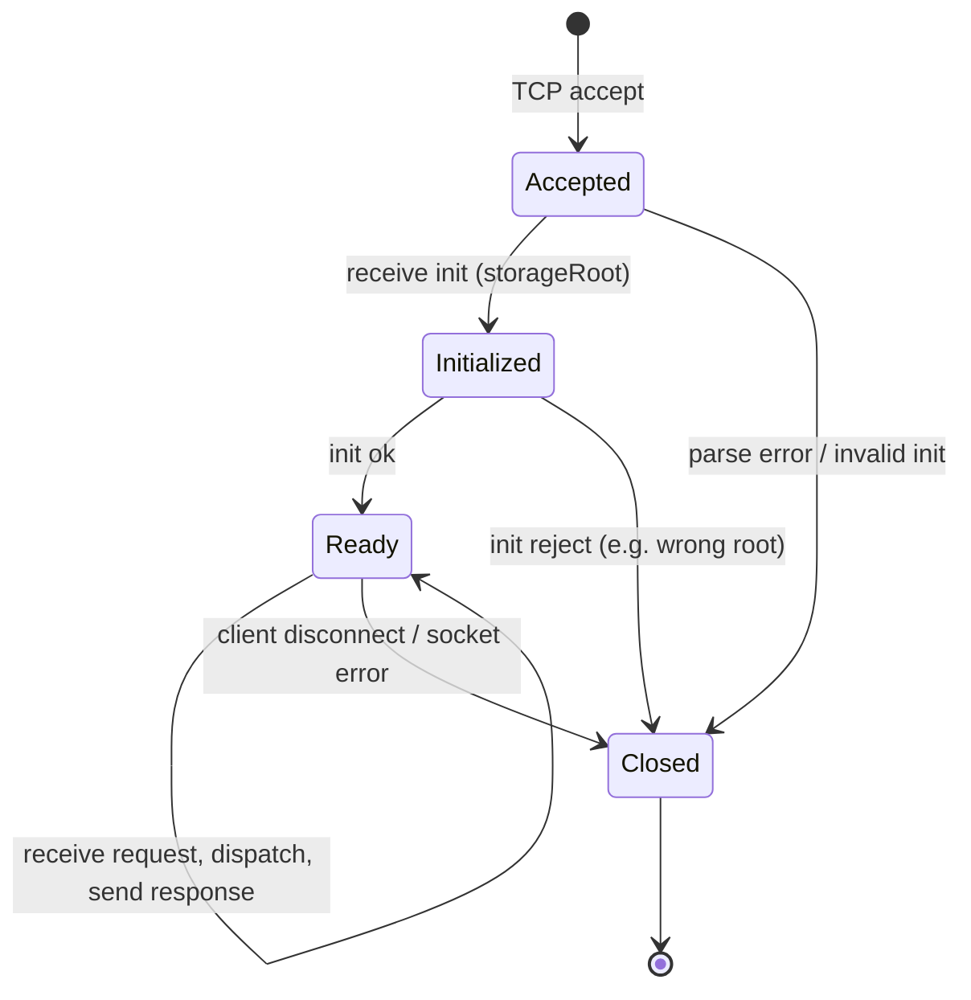
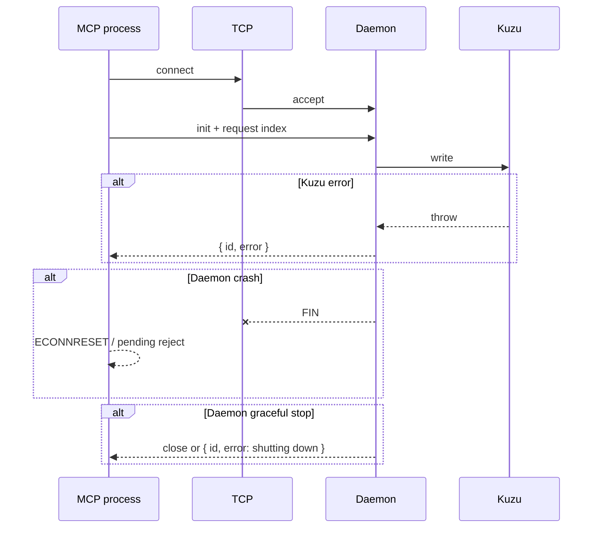

# Design: Long-Lived Graph Worker

**Goal:** One process owns the Kuzu DB at a time. When the long-lived worker is in use, CLI and MCP do not open Kuzu in-process; they send requests to that process over TCP so lock conflicts between them go away.

**Status:** **Core implemented.** This document mixes **as-built** facts (below), **historical rationale** (§1–2), **design decisions** (§3–6, largely implemented), and **spec-style** statecharts and error catalogs (§8–11). If the repo and this file disagree, **trust the code**.

---

## As-built (v0.8+)

What actually ships today:

| Piece | Role |
|-------|------|
| **`src/worker/daemon.ts`** | TCP server on `127.0.0.1`; OS-assigned or `SYSMLEGRAPH_WORKER_PORT`; writes **`worker.port`** (line 1: port, line 2: PID); **`worker.lock`** (exclusive create + PID, cleared on shutdown); **serialized** `dispatch()` per process; `shutdown` RPC; SIGINT/SIGTERM. |
| **`src/worker/dispatch.ts`** | Shared method switch for stdio **graph-worker** and daemon (same NDJSON methods). |
| **`src/worker/socket-client.ts`** | Connect, `init`, `requestLongLived`; **`SYSMLEGRAPH_WORKER_URL`** or **`worker.port`**; connect timeout; one **retry** on transient disconnect unless **`SYSMLEGRAPH_WORKER_STRICT=1`**. |
| **`src/worker/gateway.ts`** | Order: long-lived TCP → stdio worker (`SYSMLEDGRAPH_USE_WORKER=1`) → in-process handlers; **`closeGraphClient`**. |
| **`src/cli/worker-commands.ts`** + **`bin/cli.ts`** | `worker start [--detach]`, `stop`, `status`; exit **2** if `worker start` and TCP already up; stale **`worker.port`** + live PID handling; **`worker status`** reports stale port file. |
| **`src/mcp/server.ts`** | All graph tools/resources go through **gateway** (not direct `handle*` + `openGraphStore` in the hot path). |

**Storage:** `SYSMEDGRAPH_STORAGE_ROOT` (default `~/.sysmledgraph`); merged DB **`db/graph.kuzu`**.

**CLI:** `sysmledgraph worker start` runs the daemon in the **foreground** unless **`--detach`** (background child). Not `--daemon` (older draft name).

**Source of truth:** `daemon.ts`, `gateway.ts`, `socket-client.ts`, `worker-commands.ts`, `server.ts`.

**Operator summary (no statecharts):** **docs/WORKER_CONTRACT.md**.

### Implementation map (topic → code)

| Topic | Location | Notes |
|-------|----------|--------|
| Port file | `storage/location.ts` → `getWorkerPortPath()` | `{storageRoot}/worker.port` |
| Lock file | `storage/location.ts` → `getWorkerLockPath()` | `{storageRoot}/worker.lock`; acquired after stale clear, before bind |
| NDJSON protocol | `protocol.ts`, `graph-worker.ts`, `daemon.ts` | `init` then methods; same as stdio worker |
| Gateway routing | `gateway.ts` | `useLongLivedWorkerSync()` from env + port file |
| MCP tool → graph | `server.ts` → `gateway.*` | index, listIndexed, clean, cypher, query, … |
| E2E daemon tests | `test/integration/*.e2e.test.ts`, `vitest.e2e.config.ts` | `npm run test:daemon` |
| User-facing how-to | **docs/INSTALL.md**, **README.md**, **MCP_INTERACTION_GUIDE.md** §6.1 | Env, worker, Kuzu lock |

---

## 1. Problem (historical motivation)

- **Kuzu** is embedded and uses file locking: only one process can open a given DB path.
- **Without a long-lived worker:** **CLI** and **MCP** could each open the DB **in-process** (or CLI could spawn a **short-lived** stdio worker with `SYSMLEDGRAPH_USE_WORKER=1`). Running both at once on the same DB (e.g. `analyze` while Cursor uses MCP) caused **"Could not set lock on file"**.
- **Short-lived stdio worker** (`src/worker/graph-worker.ts`): used when `SYSMLEDGRAPH_USE_WORKER=1`; CLI spawns it per command. It does not by itself unify MCP + CLI unless both are refactored to use the same mechanism; the **TCP daemon + gateway** addresses that for MCP and CLI when configured.

---

## 2. Short-lived stdio worker (reference — still used)

- **Entry:** `dist/src/worker/graph-worker.js`; run as `node graph-worker.js` with stdin/stdout.
- **Protocol:** NDJSON: request `{ id, method, params? }`, response `{ id, result? } | { id, error? }`. First message must be `init` with `params.storageRoot`.
- **Methods:** `list_indexed`, `index`, `clean`, `cypher`, `query`, `context`, `impact`, `rename`, `generateMap`, `getContextContent`.
- **Client:** `src/worker/client.ts` spawns the worker, sends `init`, then `request(method, params)`. `gateway.ts` uses this when `SYSMLEDGRAPH_USE_WORKER=1`; CLI calls `closeWorker()` after each command.

---

## 3. Long-lived daemon worker (design — **implemented**)

### 3.1 Concept

- **One** long-running process (the “daemon”) is the only process that opens the Kuzu DB for that storage root when clients use long-lived mode.
- It listens on a **transport** (see below) and serves the same request/response protocol as today (NDJSON).
- **CLI** and **MCP server** act as **clients**: they connect to the daemon instead of opening the DB or spawning a child worker.
- Daemon is started **out-of-band** (user runs `sysmledgraph worker start` or a systemd/supervisor unit) or optionally **auto-started** on first client connection (with a single-instance lock so only one daemon runs per storage root).

### 3.2 Transport Options

| Option | Pros | Cons |
|--------|------|------|
| **TCP (localhost)** | Same on all platforms, easy to probe (port open/closed), works with any client. | Need to choose/fix port or use a port file; firewall rules possible. |
| **Unix domain socket** | No port, one file per instance, good for single-machine. | Windows support is “Unix socket” via named pipe under the hood in Node; path differs. |
| **Named pipe (Windows)** | Native on Windows. | Different API than Unix; need a single abstraction. |

**Recommendation:** Start with **TCP on localhost** (e.g. `127.0.0.1:port`). Port can be fixed (e.g. `0` = OS-assigned, then write port to a well-known file under storage root or `~/.sysmledgraph`) so clients know where to connect. Alternatively: one configurable port (e.g. `SYSMLEGRAPH_WORKER_PORT=9192`) or a port file under `SYSMEDGRAPH_STORAGE_ROOT` / `~/.sysmledgraph` (e.g. `worker.port`).

### 3.3 Single instance

- Only one daemon should run per **storage root** (and thus per DB path).
- **Mechanism (as-built):** **`worker.lock`** under the storage root — exclusive create (`wx`), PID written inside, file kept open until shutdown; stale lock removed if PID is not alive. Stale **`worker.port`** removed when TCP probe shows port closed. Second instance fails with a clear error if lock is held by a live process or TCP already responds on the recorded port.
- **Clients:** **`worker start`** exits **2** if TCP already answers for **`worker.port`**; does not open Kuzu in the CLI process.

### 3.4 Storage Root

- Daemon is started with a **storage root** (env `SYSMEDGRAPH_STORAGE_ROOT` or default `~/.sysmledgraph`). All DB paths are under that root.
- Same as today: one logical “graph” per indexed path (or merged), under that root. Daemon opens DBs under that root only.

### 3.5 Protocol (unchanged)

- Keep existing NDJSON protocol: one JSON object per line.
- First message from client: `init` with `params.storageRoot` (must match daemon’s storage root, or daemon ignores and uses its own; or we drop init and rely on daemon’s env).
- Then request/response by `id`. No change to method names or params.

### 3.6 Lifecycle

- **Start:** `sysmledgraph worker start` (or `npx …`) — daemon in **foreground** by default; **`--detach`** spawns a background process (stdio ignored). Reads `SYSMEDGRAPH_STORAGE_ROOT`; acquires **`worker.lock`**, binds TCP, writes **`worker.port`** (+ PID). ~~`--daemon`~~ was a draft name — use **`--detach`**.
- **Stop:** `sysmledgraph worker stop` — reads port (or PID) from the same well-known location, sends a “shutdown” request or SIGTERM to the PID so the daemon closes the DB and exits.
- **Status:** `sysmledgraph worker status` — check lock file / port file; if present, show “running” and port (or PID); else “not running”.

### 3.7 Client behavior (CLI and MCP) — **as-built**

- **CLI** (`analyze`, `list`, `clean`, `graph export|map`, …): If **`worker.port`** exists or **`SYSMLEGRAPH_WORKER_URL`** is set, **gateway** uses the **socket client** to the daemon. If unreachable: **`SYSMLEGRAPH_WORKER_STRICT=1`** → fail; else fall back to stdio worker or in-process.
- **MCP server:** **All graph tools** use **gateway** (`server.ts`). Same routing as CLI: long-lived → stdio worker → in-process. When the daemon is the designated owner and reachable, the MCP process does not open Kuzu for those ops.

### 3.8 Backward Compatibility

- **No daemon, no worker URL:** Keep current behavior: CLI and MCP open the DB in-process. “Only one process at a time” remains the user’s responsibility.
- **Daemon running + client configured:** All graph ops go to the daemon; no DB open in CLI/MCP. Lock conflicts between CLI and MCP go away when both use the same daemon.

---

## 4. Implementation outline — **completed**

The numbered plan below was the pre-ship checklist; **items 1–6 are done** in the files listed in **As-built** and **Implementation map**. **Item 7 (docs)** is maintained in **INSTALL.md**, **README.md**, and **MCP_INTERACTION_GUIDE.md** (ongoing tweaks).

1. **Daemon entrypoint** — **`daemon.ts`**: storage root, **`worker.lock`**, TCP bind, NDJSON per connection, shared **`dispatch()`**.

2. **Port / URL discovery** — **`worker.port`** + optional **`SYSMLEGRAPH_WORKER_URL`** (see `socket-client.ts`).

3. **CLI worker commands** — **`worker-commands.ts`**, **`bin/cli.ts`**: `start [--detach]`, `stop`, `status`.

4. **Socket client** — **`socket-client.ts`** (used by **gateway**).

5. **Gateway** — **`gateway.ts`** (long-lived → stdio worker → in-process).

6. **MCP server** — **`server.ts`** uses **gateway** for graph tools.

7. **Docs** — User-facing worker + env + troubleshooting (see INSTALL, README, MCP guide §6.1 / §8).

---

## 5. Out of Scope / Later

- **Auth:** Daemon listens on localhost only; no auth in this design. If we ever expose the port beyond localhost, add auth or TLS.
- **Multi-machine:** Single machine only; DB is on the same host as the daemon.
- **Graceful reload:** Not in v1; daemon is stop/start only.

---

## 6. Summary

| Item | Choice |
|------|--------|
| **Process model** | One long-lived daemon per storage root; only it opens Kuzu. |
| **Transport** | TCP on localhost; port in env or port file under storage root. |
| **Protocol** | Same NDJSON as current graph-worker (init + request/response). |
| **Single instance** | Lock file (or PID file) under storage root; bind one port. |
| **CLI** | Optional: connect to daemon when configured; else in-process. |
| **MCP** | Same: connect to daemon when configured; else in-process. |
| **Lifecycle** | `worker start` / `worker stop` / `worker status`; background via **`--detach`**. |

This design gives a single DB owner (the daemon) so that CLI and MCP never compete for the lock, while keeping backward compatibility when no daemon is used.

---

## 7. Interaction with other processes

This section contrasts **legacy in-process** access with the **gateway + optional daemon** model. **As-built:** graph operations from CLI and MCP go through **gateway** first.

### 7.1 Who opens Kuzu (as-built vs fallback)

| Process / entrypoint | When daemon / port file / URL configured | When not configured (typical fallback) |
|----------------------|------------------------------------------|----------------------------------------|
| **CLI** (`commands.ts`, `graph-artifacts.ts`) | **Gateway** → TCP to daemon (no DB in CLI). | **In-process** `openGraphStore` + handlers, or stdio worker if `SYSMLEDGRAPH_USE_WORKER=1`. |
| **MCP** (`server.ts`) | **Gateway** → TCP to daemon (no DB in MCP for those tools). | **In-process** via gateway → same handlers + `getCachedOrOpenGraphStore`. |
| **`scripts/export-graph.mjs` / `generate-map.mjs`** | Delegate to **`sysmledgraph graph export|map`** → gateway → daemon. | Same CLI path; may open DB in-process if no worker. |
| **`scripts/index-and-map.mjs`** | Spawns CLI **analyze** then **graph map**; both honor gateway/daemon. | Same; second step no longer uses a separate raw Kuzu open in the thin scripts. |
| **`scripts/index-and-query.mjs`** | Uses **gateway** `index` + `cypher` (merged DB). | N/A — always gateway in current script. |
| **clean / list** | Via gateway. | Via gateway or in-process per routing rules. |

**Lock conflict today:** Still possible if **one** side uses the **daemon** and **another** opens the **same** `graph.kuzu` **in-process** (e.g. old tooling, or mixed env). **Mitigation:** same **`SYSMEDGRAPH_STORAGE_ROOT`**, use **worker** for both CLI and MCP, or **`SYSMLEGRAPH_WORKER_STRICT=1`** to avoid silent fallback.

### 7.2 Process diagram — current (no daemon)

```
┌─────────────────────────────────────────────────────────────────────────┐
│  Same DB file (e.g. ~/.sysmledgraph/db/graph.kuzu)                      │
│  Only one process can open it at a time (Kuzu file lock).               │
└─────────────────────────────────────────────────────────────────────────┘
         ▲                    ▲                    ▲                    ▲
         │                    │                    │                    │
    ┌────┴────┐          ┌────┴────┐          ┌────┴────┐          ┌────┴────┐
    │  CLI    │          │ MCP     │          │ export- │          │generate-│
    │ process │          │ server  │          │ graph   │          │ map.mjs │
    │         │          │ process │          │ .mjs    │          │         │
    └─────────┘          └─────────┘          └─────────┘          └─────────┘
    openGraphStore()      getCachedOrOpen       new kuzu.             new kuzu.
    or spawn worker       GraphStore()          Database()            Database()
    then close                                 (separate              (separate
                                               process)               process)
    Conflict: any two of these open the same DB → "Could not set lock on file"
```

### 7.3 Process diagram — with long-lived worker (**implemented**)

```
┌─────────────────────────────────────────────────────────────────────────┐
│  Long-lived daemon (single process)                                      │
│  Opens Kuzu once; listens on TCP localhost; serves NDJSON protocol.      │
└─────────────────────────────────────────────────────────────────────────┘
         │
         │  only process that opens DB
         ▼
┌─────────────────────────────────────────────────────────────────────────┐
│  ~/.sysmledgraph/db/graph.kuzu  (Kuzu DB)                               │
└─────────────────────────────────────────────────────────────────────────┘

         ▲                    ▲                    ▲                    ▲
         │ connect            │ connect             │ connect             │ connect
         │ (TCP)              │ (TCP)              │ (TCP)               │ (TCP)
    ┌────┴────┐          ┌────┴────┐          ┌────┴────┐          ┌────┴────┐
    │  CLI   │          │ MCP     │          │ export- │          │generate-│
    │        │          │ server  │          │ graph   │          │ map.mjs │
    └────────┘          └────────┘          └─────────┘          └─────────┘
    socket client        socket client        socket client        socket client
    (no DB open)         (no DB open)         (no DB open)         (no DB open)
    request('index',…)   request('query',…)   request(cypher/…)    request('generateMap'…)
```

- **CLI:** Gateway uses socket client when worker URL/port is set; no DB open in CLI.
- **MCP server:** Same; tools go through gateway → socket client; no DB open in MCP process.
- **Scripts:** Thin wrappers call **`sysmledgraph graph export|map`** and **`analyze`**; those use **gateway** and therefore the daemon when configured. **`index-and-query.mjs`** uses **gateway** directly.

### 7.4 Summary: who talks to whom

| Actor | No daemon / in-process fallback | Daemon configured + reachable |
|-------|----------------------------------|------------------------------|
| CLI | In-process or stdio worker (`SYSMLEDGRAPH_USE_WORKER=1`) | Gateway → TCP; no DB open in CLI. |
| MCP server | Gateway → in-process handlers + `getCachedOrOpenGraphStore` | Gateway → TCP; no DB open in MCP. |
| export-graph.mjs / generate-map.mjs | CLI **`graph export|map`** may open DB in-process | Same CLI → gateway → TCP. |
| index-and-map.mjs | Two CLI subprocesses | Both honor gateway/daemon. |
| index-and-query.mjs | Gateway (always in current script) | Gateway → TCP. |
| Daemon | N/A | Single process; opens Kuzu; serves TCP clients. |

---

## 8. Statecharts

### 8.1 Daemon process lifecycle


- **NotStarted** — Daemon not running.
- **Starting** — Process started; reading env, creating lock file. On lock failure or port already in use → exit (back to NotStarted).
- **Binding** — TCP server binding; writing port (and optionally PID) to file. On bind error → exit.
- **OpeningDB** — Opening Kuzu DB (can be deferred until first request). On open error → go to Stopping.
- **Running** — Listening; for each accepted connection, run the NDJSON init + request/response loop.
- **Stopping** — Shutdown requested; stop accepting new connections.
- **Releasing** — Close all client connections; close Kuzu DB and connection; release file lock; remove port file.
- **Stopped** — Process exits.

### 8.2 Client (gateway) state when using the worker



- **Deciding** — Gateway checks whether to use daemon (env `SYSMLEGRAPH_WORKER_URL` or port file under storage root) or in-process.
- **InProcess** — Use current behavior: open DB in this process (or spawn short-lived stdio worker when `SYSMLEDGRAPH_USE_WORKER=1`).
- **Resolving** — Resolve daemon address (read port file or parse URL).
- **Connecting** — TCP connect to daemon.
- **Connected** — Send `init`, then one or more `request(method, params)`; receive responses.
- **Disconnected** — Socket closed or error; retry or fall back to in-process when **not** strict.
- **Failed (StrictError)** — Terminal error when **`SYSMLEGRAPH_WORKER_STRICT=1`**: daemon was expected (URL or port file path policy) but endpoint missing, TCP/init failed, or unrecoverable disconnect; **no** fallback to in-process. Implemented in **`gateway.ts`** / **`socket-client.ts`**.

### 8.3 Per-connection state (daemon side, one TCP connection)



- **Accepted** — New socket accepted; reading first line (expected: `init`).
- **Initialized** — `init` received and accepted (storageRoot matches or ignored); connection is ready for requests.
- **Ready** — Serve NDJSON request/response (same dispatch as current graph-worker).
- **Closed** — Socket closed; daemon drops reference; no DB close (DB is process-global in daemon).

---

## 9. Error states and status

This section catalogs error conditions, exit codes, and how each component reports failure.

### 9.1 Daemon error conditions and exit codes

| Phase | Error | Daemon behavior | Exit code |
|-------|--------|-----------------|-----------|
| **Starting** | Storage root invalid or missing | Log to stderr, exit | 1 |
| **Starting** | Lock file already held (another daemon or stale PID) | Log "already running" or "lock failed", exit | 2 |
| **Starting** | Port in use (config or port file points to bound port) | Log "port in use", exit | 3 |
| **Binding** | TCP bind failure (e.g. permission, address in use) | Log bind error, exit | 4 |
| **Binding** | Cannot write port file (e.g. storage root read-only) | Log write error, exit | 5 |
| **OpeningDB** | Kuzu fails to open DB (corrupt, permission, path) | Log open error, go to Stopping, release lock, exit | 6 |
| **Running** | Unhandled exception in request handler | Log error, respond `{ id, error }` to that request; connection stays open | — |
| **Running** | Fatal process error (e.g. OOM) | Process exits; OS may report signal | — |
| **Stopping** | Error while closing DB or connections | Log error; still release lock and remove port file, exit | 0 or 7 |

- **Exit 0:** Normal shutdown (stop command or SIGTERM handled).
- **Exit 1–7:** Startup or shutdown failure; message on stderr.

### 9.2 Client (gateway) error conditions

| State | Error | Client behavior | Surfaces as |
|-------|--------|------------------|-------------|
| **Resolving** | Port file missing | Treat as "daemon not running"; go to InProcess (fallback) or fail | Fallback to in-process, or CLI exit 1 with "worker not running" |
| **Resolving** | Port file unreadable / invalid content | Same as port file missing | Same |
| **Connecting** | TCP connect refused (daemon not running) | Retry (if configured) or go to InProcess / fail | Retry or "Cannot connect to worker" |
| **Connecting** | TCP timeout | Same | Same |
| **Connected** | Socket closed by daemon (e.g. daemon exit) | Disconnected; pending requests reject | Promise reject / error callback |
| **Connected** | Socket error (ECONNRESET, etc.) | Disconnected; pending requests reject | Same |
| **Connected** | Response `{ id, error }` for a request | No state change; return error to caller | Tool/CLI returns `ok: false, error: "…"` |
| **Connected** | Malformed response line | Treat as connection error → Disconnected | Promise reject |
| **Initialized** | Daemon rejects init (e.g. wrong storageRoot) | Connection closed by daemon; client sees disconnect | Connect or first request fails |

- **Strict mode (no fallback):** When daemon is configured but unreachable, CLI/MCP fail with a clear error (e.g. "Worker not running; start with `sysmledgraph worker start`").
- **Fallback mode:** On connect or resolve failure, gateway falls back to in-process (or short-lived worker); if in-process also fails (e.g. DB lock), user sees the usual Kuzu lock error.

### 9.3 Per-connection (daemon side) error handling

| State | Error | Daemon behavior | Client sees |
|-------|--------|------------------|-------------|
| **Accepted** | First line not valid JSON | Close socket, log "invalid init" | Socket closed |
| **Accepted** | First message not `init` | Close socket, log "expected init" | Socket closed |
| **Initialized** | storageRoot mismatch (if enforced) | Send error response or close; log | Error or disconnect |
| **Ready** | Request line not valid JSON | Send `{ id, error: "Invalid JSON" }` (if id known), else close | Error response or disconnect |
| **Ready** | Unknown method | Send `{ id, error: "Unknown method: …" }` | Error response |
| **Ready** | Handler throws (e.g. Kuzu query error) | Catch, send `{ id, error: message }` | Error response |
| **Ready** | Socket error on read/write | Close socket, log | Socket closed |

- The daemon never exits on a single connection or request error; only process-level failures (startup, DB open, fatal) cause exit.

### 9.4 CLI worker commands — exit codes and stderr

| Command | Success | Error | Exit code |
|---------|---------|--------|-----------|
| **worker start** | Daemon started (foreground or background) | Already running, lock fail, bind error, etc. | 0 = started; 2 = already running; 1,3,4,5 = other start failure |
| **worker stop** | Daemon stopped cleanly | No daemon running, or stop failed | 0 = stopped; 1 = not running or error |
| **worker status** | Daemon running; print port/PID | Daemon not running | 0 = running; 1 = not running |

- All error messages go to stderr; status (e.g. "running on port 9192") to stdout for scripting.

### 9.5 Error state summary in statecharts

Daemon and client statecharts already include failure transitions; below is a compact reference.

**Daemon:**  
`Starting --[lock fail / port in use]--> NotStarted (exit 2/3)`;  
`Binding --[bind error]--> NotStarted (exit 4)`;  
`OpeningDB --[open error]--> Stopping --> Releasing --> Stopped (exit 6)`.

**Client:**  
`Resolving --[no port / not running]--> InProcess (fallback)`;  
`Connecting --[refused / timeout]--> InProcess (fallback) or fail`;  
`Connected --[socket error / close]--> Disconnected --[give up]--> InProcess (fallback)`.

**Connection:**  
`Accepted --[parse error / invalid init]--> Closed`;  
`Initialized --[wrong root]--> Closed`;  
`Ready --[request handler throws]--> Ready` (respond with `{ id, error }`);  
`Ready --[socket error]--> Closed`.

---

## 10. Evaluation of state machines

This section evaluates the §8 statecharts against §9 errors, invariants, and implementation risk.

### 10.1 Layering and orthogonality

| Machine | Scope | Orthogonal to |
|---------|--------|----------------|
| **§8.1 Daemon lifecycle** | One process, one DB owner | Each TCP connection (§8.3) is a **parallel** sub-state while daemon is **Running**. |
| **§8.2 Client (gateway)** | One client process per graph operation session | Independent of daemon’s per-connection state; client only sees connect / send / receive. |
| **§8.3 Per-connection** | One socket on the daemon | Many instances can exist concurrently in **Ready** while daemon is **Running**. |

**Composite view (daemon Running):**  
`Daemon.Running` ∧ `⋀ᵢ Connectionᵢ ∈ { Accepted, Initialized, Ready, Closed }`.  
Closing one connection must not imply others leave **Ready** unless the whole process is **Stopping**.

### 10.2 Safety and liveness properties

| Property | Type | Statement | Satisfied if |
|----------|------|-----------|--------------|
| **Single DB owner** | Safety | At most one process holds the Kuzu lock for a given storage root. | Only daemon in **OpeningDB…Running…Releasing** opens the DB; clients never open when daemon mode is on. |
| **No orphan lock** | Safety | On any daemon exit path, lock file and port file are released or process is dead. | **Releasing** always runs on normal stop; startup failures before lock must not leave a stale lock (design: only take lock after bind succeeds, or use PID+heartbeat). |
| **Client termination** | Liveness | Every client request eventually yields `{ id, result }`, `{ id, error }`, or a connection error (no infinite hang without timeout). | Implement connect timeout, read timeout per line, and optional request timeout. |
| **Idempotent stop** | Safety | **worker stop** when already stopped exits 0 or 1 consistently (documented). | §9.4 defines behavior. |

**Gap (design refinement):** If **OpeningDB** is **lazy** (open on first request), **Running** can occur before the DB exists; the first **Ready** request may transition an internal sub-state **DBOpening** → failure must still map to §9.1 exit 6 and **Stopping**. The §8.1 diagram should either show **Running** with a nested “DB ready / DB opening” or document lazy open explicitly in §10.4.

### 10.3 Consistency: §8 diagrams vs §9 tables

| §9 reference | Present in §8? | Note |
|--------------|----------------|------|
| Starting failures → exit 1,2,3 | Partially | §8.1 merges lock and port as one edge to **NotStarted**; §9 splits exit 2 vs 3 — **implementation** must map each failure to the right code; diagram is coarse. |
| Binding failures → 4, 5 | Only bind error | Port **file** write failure (§9 exit 5) is a sub-transition of **Binding**; add label or footnote in §8.1 if desired. |
| OpeningDB → Stopping on error | Yes | Aligns with exit 6 after **Releasing**. |
| Client strict vs fallback | Yes | §8.2 includes **Failed** (**StrictError**) and strict transitions; **`SYSMLEGRAPH_WORKER_STRICT`**. |
| Per-connection **Ready** errors | Partially | §8.3 lacks a self-loop label “handler error → stay Ready”; §9.3 and §9.5 describe it. |

### 10.4 Concurrency and serialization

- **Multiple connections in Ready:** Kuzu may not allow concurrent writers from multiple connections in the same process; evaluation assumes **one Connection** per client process (MCP keeps one socket) or a **single request queue** inside the daemon (serialize dispatches). Document in implementation: either one active client connection or a mutex around `dispatch()`.
- **Stopping while requests in flight:** **Stopping** should drain or reject new accepts; in-flight requests either complete or get `{ id, error: "shutting down" }` before socket close.

### 10.5 Test matrix (black-box)

| # | From state (machine) | Event | Expected |
|---|----------------------|--------|----------|
| D1 | NotStarted | worker start, good env | Running, port file exists |
| D2 | Starting | lock held | Exit 2, no port file |
| D3 | Binding | EADDRINUSE | Exit 4 or 3 per policy |
| D4 | OpeningDB | corrupt DB | Exit 6 after cleanup attempt |
| D5 | Running | SIGTERM | Stopped, lock released |
| C1 | Deciding | no env, no port file | InProcess |
| C2 | Resolving | strict + missing port file | Fail (no InProcess) |
| C3 | Connecting | refused, fallback on | InProcess |
| C4 | Connected | response `{ id, error }` | Stay Connected, caller sees error |
| N1 | Accepted | garbage first line | Closed |
| N2 | Ready | unknown method | Stay Ready, error line out |
| N3 | Ready | daemon stop | Closed |

### 10.6 Summary verdict

- **Adequate for design:** §8–§9 together cover startup, shutdown, client paths, and connection-level errors.
- **Implementation notes:** **Multi-connection serialization** is implemented in the daemon (**`runSerialized`** around **`dispatch()`**). **Strict vs fallback** is implemented via **`SYSMLEGRAPH_WORKER_STRICT`** and gateway logic; §8.2 **Failed** state documents strict failure. Remaining doc refinements: explicit **lazy DB open** if the daemon ever defers Kuzu open to first request; align §8.1 coarse failure edges with §9.1 exit-code split in comments if desired.

---

## 11. Evaluation of interactions

This section evaluates **how actors interact** (§7) under the **implemented** daemon model: concurrency, ordering, shared configuration, and failure propagation.

### 11.1 Interaction matrix (two actors, same storage root)

Rows and columns are **processes**; cell = outcome if both are active **at the same time** (or in quick succession where relevant).

|  | **Daemon (Running)** | **CLI (daemon client)** | **MCP (daemon client)** | **CLI (in-process, no daemon)** | **MCP (in-process)** |
|--|------------------------|-------------------------|-------------------------|----------------------------------|----------------------|
| **Daemon** | — | OK: CLI talks to TCP only | OK: MCP talks to TCP only | **Bad:** CLI opens DB → lock conflict with daemon | **Bad:** MCP opens DB → lock conflict |
| **CLI (daemon)** | OK | OK (sequential or parallel TCP sessions if daemon serializes) | OK (same) | N/A | N/A |
| **MCP (daemon)** | OK | OK | OK if daemon serializes; risk if not (§10.4) | N/A | N/A |
| **CLI (in-process)** | **Bad** | N/A | **Bad** with MCP in-process | OK alone | **Bad** with MCP |
| **MCP (in-process)** | **Bad** | **Bad** | **Bad** | **Bad** | **Bad** (two MCPs) |

**Takeaway:** Interaction is **safe** only when **every** actor that touches the graph uses the **same mode**: either all go through the daemon for that storage root, or none uses the daemon and only one in-process holder exists. **Mixed mode** (daemon + any in-process open on same DB) is always **Bad**.

### 11.2 Configuration coupling

| Shared artifact | Who reads it | Mismatch effect |
|-----------------|--------------|-----------------|
| **`SYSMEDGRAPH_STORAGE_ROOT`** | Daemon at start; CLI/MCP before connect | Clients resolve wrong port file path or talk to a daemon serving a different DB tree. |
| **Port file** (`worker.port` or similar) | Clients discover daemon | Stale port after crash: client connects to wrong process or gets refused. Mitigation: PID in file + heartbeat or `worker status`. |
| **`SYSMLEGRAPH_WORKER_URL`** | Clients | Overrides port file; must point at daemon for **same** storage root. |
| **Init `storageRoot`** (per connection) | Daemon | If enforced, mismatch → connection closed (§9.3). |

**Evaluation:** Interactions are **correct** only if storage root and worker address are **consistent** across Cursor config, shell, and CI. Document a single “source of truth” checklist for users.

### 11.3 Ordering and causal dependencies

| Scenario | Required order | Violation |
|----------|----------------|-----------|
| Query / context / impact | Index exists for paths | Empty or stale graph; not a lock issue but confusing UX. |
| **generate-map** after **analyze** | Analyze completes before map reads graph | Today satisfied by sequential spawn in `index-and-map.mjs`. With daemon, both are requests; same ordering preserved if script awaits CLI exit before generate-map. |
| **clean** then **index** | Clean finishes before new index | If concurrent clients: clean and index interleaved → undefined graph content; daemon should **serialize** or document “no concurrent clean + index”. |
| **worker stop** while MCP active | Stop closes daemon | MCP’s next tool call fails (disconnect); user must restart daemon or disable worker mode. |

**Evaluation:** The daemon does not automatically enforce **semantic** ordering beyond what each handler does; **concurrent** `index` and `clean` from CLI and MCP is a design risk → recommend **serialized dispatch** (§10.4) for all mutating ops.

### 11.4 Failure propagation across boundaries



| Failure origin | Observed by client | Mitigation |
|----------------|--------------------|------------|
| Kuzu in handler | `{ id, error }`; connection stays up | Caller shows tool error. |
| Daemon OOM / kill -9 | Socket error; pending requests reject | User restarts daemon; MCP may need reconnect logic. |
| Graceful **worker stop** | Drain or error responses, then close | MCP: treat as transient; document “restart worker”. |
| Stale port file | Connect to wrong host/port | **worker status** + timeout on connect. |

### 11.5 Orthogonal channels (no direct interaction)

| Channel A | Channel B | Interaction |
|-----------|-----------|-------------|
| **MCP stdio** (Cursor ↔ sysmledgraph MCP) | **Worker TCP** (client ↔ daemon) | None at protocol level; both terminate in the **same Node process** only if MCP does not use daemon (in-process). If MCP uses daemon, MCP process holds **two** roles: MCP server to Cursor + TCP client to daemon — still no stdio between them. |
| **sysmledgraph** LSP / sysml-v2-lsp MCP | Graph daemon | Independent; indexing uses LSP for symbols, daemon for graph only. |

**Evaluation:** No hidden coupling between MCP framing and worker NDJSON; errors on one channel do not automatically surface on the other unless the same user action triggers both (e.g. index uses LSP then graph).

### 11.6 Summary: interaction verdict

| Criterion | Verdict |
|-----------|---------|
| **Eliminates DB lock between CLI and MCP** | Yes, if **both** use daemon and **no** in-process opener for that root. |
| **Safe under misconfiguration** | No — mixed daemon + in-process causes lock conflict; strict mode + docs reduce risk. |
| **Concurrent MCP + CLI** | OK with daemon + serialization; undefined if mutating ops overlap without ordering. |
| **Scripts (export-map pipeline)** | **OK** when scripts use CLI/graph commands (gateway); avoid legacy raw Kuzu opens on the same DB. |
| **Operational clarity** | Improve with **worker status**, consistent env, and a short “who must use daemon” table in INSTALL. |
