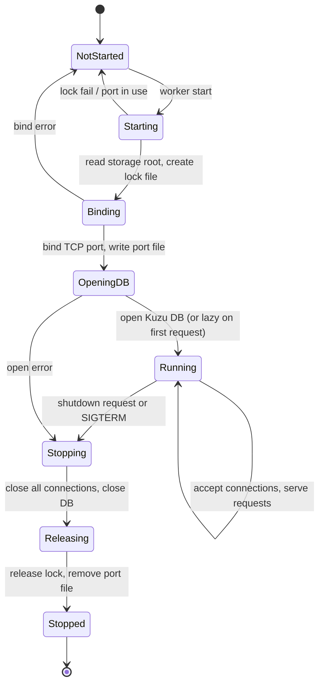
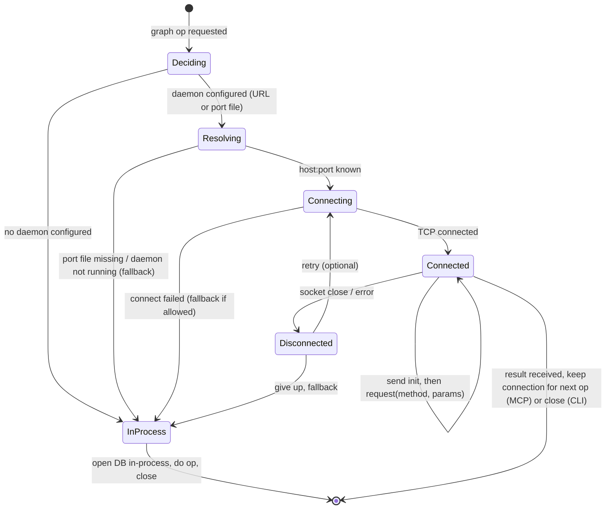
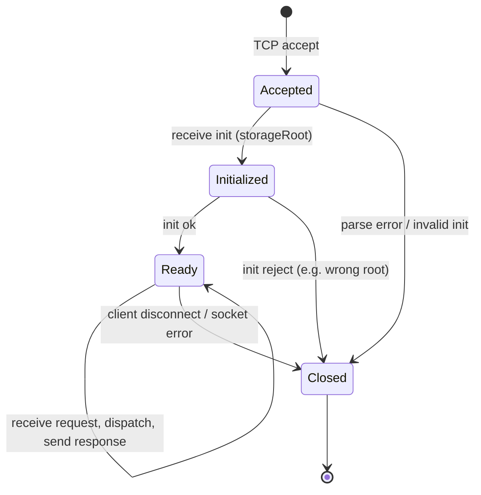

# Design: Long-Lived Graph Worker

**Goal:** One process owns the Kuzu DB at a time. CLI and MCP never open the DB directly; they talk to a single long-lived worker so lock conflicts never stop the DB process.

**Status:** Design only. Not implemented.

---

## 1. Problem

- **Kuzu** is embedded and uses file locking: only one process can open a given DB path.
- Today: **CLI** and **MCP server** each open the DB in their own process (or spawn a short-lived worker with `SYSMLEDGRAPH_USE_WORKER=1`). Running both at once (e.g. `sysmledgraph analyze` while Cursor uses the MCP) causes "Could not set lock on file".
- We already have a **graph worker** (`src/worker/graph-worker.ts`) that can own the DB and handle the same operations over **stdio** (NDJSON). It is only used when `SYSMLEDGRAPH_USE_WORKER=1`, and the CLI spawns it per command then closes it; the MCP server does not use it at all. So there is no single long-lived owner.

---

## 2. Current Worker (Reference)

- **Entry:** `dist/src/worker/graph-worker.js`; run as `node graph-worker.js` with stdin/stdout.
- **Protocol:** NDJSON: request `{ id, method, params? }`, response `{ id, result? } | { id, error? }`. First message must be `init` with `params.storageRoot`.
- **Methods:** `list_indexed`, `index`, `clean`, `cypher`, `query`, `context`, `impact`, `rename`, `generateMap`, `getContextContent`.
- **Client:** `src/worker/client.ts` spawns the worker, sends `init`, then `request(method, params)`. `gateway.ts` uses this when `SYSMLEDGRAPH_USE_WORKER=1`; CLI calls `closeWorker()` after each command.

---

## 3. Proposed: Long-Lived Daemon Worker

### 3.1 Concept

- **One** long-running process (the “daemon”) is the only process that opens the Kuzu DB.
- It listens on a **transport** (see below) and serves the same request/response protocol as today (NDJSON).
- **CLI** and **MCP server** act as **clients**: they connect to the daemon instead of opening the DB or spawning a child worker.
- Daemon is started **out-of-band** (user runs `sysmledgraph worker start` or a systemd/supervisor unit) or optionally **auto-started** on first client connection (with a single-instance lock so only one daemon runs per storage root).

### 3.2 Transport Options

| Option | Pros | Cons |
|--------|------|------|
| **TCP (localhost)** | Same on all platforms, easy to probe (port open/closed), works with any client. | Need to choose/fix port or use a port file; firewall rules possible. |
| **Unix domain socket** | No port, one file per instance, good for single-machine. | Windows support is “Unix socket” via named pipe under the hood in Node; path differs. |
| **Named pipe (Windows)** | Native on Windows. | Different API than Unix; need a single abstraction. |

**Recommendation:** Start with **TCP on localhost** (e.g. `127.0.0.1:port`). Port can be fixed (e.g. `0` = OS-assigned, then write port to a well-known file under storage root or `~/.sysmledgraph`) so clients know where to connect. Alternatively: one configurable port (e.g. `SYSMLEGRAPH_WORKER_PORT=9192`) or a port file under `SYSMEDGRAPH_STORAGE_ROOT` / `~/.sysmledgraph` (e.g. `worker.port`).

### 3.3 Single Instance

- Only one daemon should run per **storage root** (and thus per DB path).
- **Mechanism:** Before opening the DB, the daemon creates a **lock file** (e.g. `{storageRoot}/.worker.lock` or `{storageRoot}/worker.pid`) and holds an exclusive file lock (or writes PID and checks process exists). If lock fails or another daemon is already bound to the chosen port, exit with a clear error.
- **Clients:** If they try to start a second daemon (e.g. “worker start” when one is already running), they get “already running” and exit; they do not open the DB themselves.

### 3.4 Storage Root

- Daemon is started with a **storage root** (env `SYSMEDGRAPH_STORAGE_ROOT` or default `~/.sysmledgraph`). All DB paths are under that root.
- Same as today: one logical “graph” per indexed path (or merged), under that root. Daemon opens DBs under that root only.

### 3.5 Protocol (unchanged)

- Keep existing NDJSON protocol: one JSON object per line.
- First message from client: `init` with `params.storageRoot` (must match daemon’s storage root, or daemon ignores and uses its own; or we drop init and rely on daemon’s env).
- Then request/response by `id`. No change to method names or params.

### 3.6 Lifecycle

- **Start:** `sysmledgraph worker start` (or `npx sysmledgraph worker start`) — starts the daemon in the foreground or background (e.g. `--daemon` to fork and write PID to a file). Reads `SYSMEDGRAPH_STORAGE_ROOT`; binds to port (or port file); takes lock; runs the same dispatch loop as current graph-worker but over the socket.
- **Stop:** `sysmledgraph worker stop` — reads port (or PID) from the same well-known location, sends a “shutdown” request or SIGTERM to the PID so the daemon closes the DB and exits.
- **Status:** `sysmledgraph worker status` — check lock file / port file; if present, show “running” and port (or PID); else “not running”.

### 3.7 Client Behavior (CLI and MCP)

- **CLI** (`analyze`, `list`, `clean`, etc.): If a long-lived worker is configured (e.g. env `SYSMLEGRAPH_WORKER_URL=http://127.0.0.1:9192` or “use port file under storage root”), **connect to the daemon** and send the same requests. If the daemon is not running, either:
  - **Strict:** Fail with “worker not running; start with `sysmledgraph worker start`”, or
  - **Optional fallback:** If no worker URL and no daemon, fall back to current in-process behavior (open DB in CLI) so existing usage still works.
- **MCP server:** Same: if worker URL/port is configured (or found via port file), connect to the daemon for all graph operations. Otherwise fall back to in-process (current behavior). MCP server must **not** open the DB when the daemon is the designated owner.

### 3.8 Backward Compatibility

- **No daemon, no worker URL:** Keep current behavior: CLI and MCP open the DB in-process. “Only one process at a time” remains the user’s responsibility.
- **Daemon running + client configured:** All graph ops go to the daemon; no DB open in CLI/MCP. Lock conflicts between CLI and MCP go away when both use the same daemon.

---

## 4. Implementation Outline

1. **Daemon entrypoint**  
   New entrypoint (e.g. `src/worker/daemon.ts` or extend `graph-worker.ts` with a “listen” mode): read storage root from env; create lock file; bind TCP server (or Unix socket); accept connections; for each connection, run the same NDJSON init + request/response loop as current graph-worker (reuse `dispatch()` and handlers).

2. **Port / URL discovery**  
   Daemon writes `port` (and optionally PID) to a file under storage root (e.g. `worker.port`). Clients read that file to get `host:port` (host fixed to 127.0.0.1 when using this file).

3. **CLI worker commands**  
   `sysmledgraph worker start [--daemon]`, `sysmledgraph worker stop`, `sysmledgraph worker status`. Implement in `src/cli/commands.ts` or a small `worker-cli.ts`.

4. **Socket client**  
   New client (e.g. `src/worker/socket-client.ts`) that connects to `host:port`, sends NDJSON lines, receives NDJSON lines. Reuse the same `request(method, params)` API as the current client. Used by gateway when “long-lived worker” is configured.

5. **Gateway / config**  
   Gateway uses long-lived worker when e.g. `SYSMLEGRAPH_WORKER_URL` is set or port file exists under storage root; otherwise fall back to “spawn child worker” (current `SYSMLEDGRAPH_USE_WORKER=1`) or in-process. This keeps a single code path for “use a worker” vs “use in-process”.

6. **MCP server**  
   MCP server uses the same gateway; when gateway uses the socket client, MCP never opens the DB.

7. **Docs**  
   Update INSTALL.md and MCP_INTERACTION_GUIDE (troubleshooting) to describe: run `sysmledgraph worker start` before using CLI and Cursor; or set `SYSMLEGRAPH_WORKER_URL`; and that only one daemon per storage root.

---

## 5. Out of Scope / Later

- **Auth:** Daemon listens on localhost only; no auth in this design. If we ever expose the port beyond localhost, add auth or TLS.
- **Multi-machine:** Single machine only; DB is on the same host as the daemon.
- **Graceful reload:** Not in v1; daemon is stop/start only.

---

## 6. Summary

| Item | Choice |
|------|--------|
| **Process model** | One long-lived daemon per storage root; only it opens Kuzu. |
| **Transport** | TCP on localhost; port in env or port file under storage root. |
| **Protocol** | Same NDJSON as current graph-worker (init + request/response). |
| **Single instance** | Lock file (or PID file) under storage root; bind one port. |
| **CLI** | Optional: connect to daemon when configured; else in-process. |
| **MCP** | Same: connect to daemon when configured; else in-process. |
| **Lifecycle** | `worker start` / `worker stop` / `worker status`; optional `--daemon`. |

This design gives a single DB owner (the daemon) so that CLI and MCP never compete for the lock, while keeping backward compatibility when no daemon is used.

---

## 7. Interaction with other processes

This section lists every process or script that touches the Kuzu DB today, and how each would interact with the long-lived worker.

### 7.1 Processes that touch the DB today

| Process / entrypoint | How it opens the DB | Code path |
|----------------------|---------------------|-----------|
| **CLI** (`bin/cli.js` → `commands.ts`) | If `SYSMLEDGRAPH_USE_WORKER=1`: spawns **child** graph-worker (stdio), uses it, then **closes** it. Else: **in-process** `openGraphStore()` + `runIndexer()`; `store.close()` in `finally`. | `cmdAnalyze` → gateway `index()` or `openGraphStore` + `runIndexer`; `cmdList`/`cmdClean` same pattern. |
| **MCP server** (Cursor runs `sysmledgraph-mcp` → `mcp/index.ts` → `server.ts`) | **In-process only.** Does not use the gateway. Each tool calls handlers that use `getCachedOrOpenGraphStore(dbPath)`; one cached store per dbPath for the lifetime of the MCP process. | `server.ts` → `handleIndexDbGraph`, `handleCypher`, etc. → `getCachedOrOpenGraphStore()` in each tool. |
| **export-graph.mjs** | **Own process.** Creates `new kuzu.Database(dbPath)` and `new kuzu.Connection(db)` directly. | Reads storage root and DB path; opens Kuzu in the script process. |
| **generate-map.mjs** | **Own process.** Same: `new kuzu.Database(dbPath)`, `new kuzu.Connection(db)`. | Same pattern; used by `index-and-map.mjs` as a second step (after CLI analyze). |
| **index-and-map.mjs** | **Indirect.** Spawns two children: (1) `node dist/bin/cli.js analyze <path>` (CLI, which may open DB in-process or via short-lived worker), (2) `node scripts/generate-map.mjs` (which opens the DB again in a different process). | Two separate processes; the second opens the DB while the first may have just closed it (if CLI in-process) or never held it (if CLI used worker and closed it). So often no conflict only because CLI exits before generate-map runs. |
| **index-and-query.mjs** | **In-process.** Imports `openGraphStore`, `runIndexer`; opens DB in the script process. | Single script process; same lock rules as any other single process. |
| **storage/clean.ts** | Used by MCP `clean_index` and by CLI `cmdClean` (via gateway or in-process). Uses `getCachedOrOpenGraphStore` then `closeGraphStoreCache`. | Part of MCP tool handlers and CLI path; not a separate process. |

**Conclusion (current):** Any two of the following running at the same time can conflict on the same DB: CLI (in-process), MCP server, export-graph.mjs, generate-map.mjs, index-and-query.mjs. The only way to avoid conflict today is to run only one of them at a time, or use `SYSMLEDGRAPH_USE_WORKER=1` for CLI (which still doesn’t help MCP or the scripts).

### 7.2 Process diagram — current (no daemon)

```
┌─────────────────────────────────────────────────────────────────────────┐
│  Same DB file (e.g. ~/.sysmledgraph/db/graph.kuzu)                      │
│  Only one process can open it at a time (Kuzu file lock).               │
└─────────────────────────────────────────────────────────────────────────┘
         ▲                    ▲                    ▲                    ▲
         │                    │                    │                    │
    ┌────┴────┐          ┌────┴────┐          ┌────┴────┐          ┌────┴────┐
    │  CLI    │          │ MCP     │          │ export- │          │generate-│
    │ process │          │ server  │          │ graph   │          │ map.mjs │
    │         │          │ process │          │ .mjs    │          │         │
    └─────────┘          └─────────┘          └─────────┘          └─────────┘
    openGraphStore()      getCachedOrOpen       new kuzu.             new kuzu.
    or spawn worker       GraphStore()          Database()            Database()
    then close                                 (separate              (separate
                                               process)               process)
    Conflict: any two of these open the same DB → "Could not set lock on file"
```

### 7.3 Process diagram — with long-lived worker (proposed)

```
┌─────────────────────────────────────────────────────────────────────────┐
│  Long-lived daemon (single process)                                      │
│  Opens Kuzu once; listens on TCP localhost; serves NDJSON protocol.      │
└─────────────────────────────────────────────────────────────────────────┘
         │
         │  only process that opens DB
         ▼
┌─────────────────────────────────────────────────────────────────────────┐
│  ~/.sysmledgraph/db/graph.kuzu  (Kuzu DB)                               │
└─────────────────────────────────────────────────────────────────────────┘

         ▲                    ▲                    ▲                    ▲
         │ connect            │ connect             │ connect             │ connect
         │ (TCP)              │ (TCP)              │ (TCP)               │ (TCP)
    ┌────┴────┐          ┌────┴────┐          ┌────┴────┐          ┌────┴────┐
    │  CLI   │          │ MCP     │          │ export- │          │generate-│
    │        │          │ server  │          │ graph   │          │ map.mjs │
    └────────┘          └────────┘          └─────────┘          └─────────┘
    socket client        socket client        socket client        socket client
    (no DB open)         (no DB open)         (no DB open)         (no DB open)
    request('index',…)   request('query',…)   request(cypher/…)    request('generateMap'…)
```

- **CLI:** Gateway uses socket client when worker URL/port is set; no DB open in CLI.
- **MCP server:** Same; tools go through gateway → socket client; no DB open in MCP process.
- **Scripts:** To avoid opening the DB themselves, they must either (a) call the CLI (e.g. `sysmledgraph analyze` already goes through daemon if configured) or (b) use a small client that sends requests to the daemon. For **generate-map** and **export-graph**, we’d add a daemon method that returns the map or export data (or we implement a “run cypher and return rows” and have the script request that), so the script process never opens Kuzu. **index-and-map.mjs** would stay as “spawn CLI analyze then spawn generate-map”; once both CLI and generate-map talk to the daemon, no script process opens the DB.

### 7.4 Summary: who talks to whom

| Actor | Current | With long-lived worker |
|-------|---------|-------------------------|
| CLI | Opens DB in-process, or spawns short-lived worker (stdio) then closes it | Connects to daemon over TCP; no DB open. |
| MCP server | Opens DB in-process (getCachedOrOpenGraphStore) | Connects to daemon over TCP; no DB open. |
| export-graph.mjs | Opens DB in-process (new kuzu.Database) | Must use daemon (e.g. request export or cypher); no DB open. |
| generate-map.mjs | Opens DB in-process (new kuzu.Database) | Must use daemon (e.g. request generateMap or equivalent); no DB open. |
| index-and-map.mjs | Spawns CLI then generate-map (two children; second opens DB) | Spawns CLI then generate-map; both children talk to daemon; no DB open in script. |
| index-and-query.mjs | Opens DB in-process | Must use daemon (e.g. request index + query); no DB open. |
| Daemon | N/A | Single process; only one that opens Kuzu; serves all above via TCP. |

---

## 8. Statecharts

### 8.1 Daemon process lifecycle



- **NotStarted** — Daemon not running.
- **Starting** — Process started; reading env, creating lock file. On lock failure or port already in use → exit (back to NotStarted).
- **Binding** — TCP server binding; writing port (and optionally PID) to file. On bind error → exit.
- **OpeningDB** — Opening Kuzu DB (can be deferred until first request). On open error → go to Stopping.
- **Running** — Listening; for each accepted connection, run the NDJSON init + request/response loop.
- **Stopping** — Shutdown requested; stop accepting new connections.
- **Releasing** — Close all client connections; close Kuzu DB and connection; release file lock; remove port file.
- **Stopped** — Process exits.

### 8.2 Client (gateway) state when using the worker



- **Deciding** — Gateway checks whether to use daemon (env `SYSMLEGRAPH_WORKER_URL` or port file under storage root) or in-process.
- **InProcess** — Use current behavior: open DB in this process (or spawn short-lived stdio worker when `SYSMLEDGRAPH_USE_WORKER=1`).
- **Resolving** — Resolve daemon address (read port file or parse URL).
- **Connecting** — TCP connect to daemon.
- **Connected** — Send `init`, then one or more `request(method, params)`; receive responses.
- **Disconnected** — Socket closed or error; retry or fall back to in-process.

### 8.3 Per-connection state (daemon side, one TCP connection)



- **Accepted** — New socket accepted; reading first line (expected: `init`).
- **Initialized** — `init` received and accepted (storageRoot matches or ignored); connection is ready for requests.
- **Ready** — Serve NDJSON request/response (same dispatch as current graph-worker).
- **Closed** — Socket closed; daemon drops reference; no DB close (DB is process-global in daemon).

---

## 9. Error states and status

This section catalogs error conditions, exit codes, and how each component reports failure.

### 9.1 Daemon error conditions and exit codes

| Phase | Error | Daemon behavior | Exit code |
|-------|--------|-----------------|-----------|
| **Starting** | Storage root invalid or missing | Log to stderr, exit | 1 |
| **Starting** | Lock file already held (another daemon or stale PID) | Log "already running" or "lock failed", exit | 2 |
| **Starting** | Port in use (config or port file points to bound port) | Log "port in use", exit | 3 |
| **Binding** | TCP bind failure (e.g. permission, address in use) | Log bind error, exit | 4 |
| **Binding** | Cannot write port file (e.g. storage root read-only) | Log write error, exit | 5 |
| **OpeningDB** | Kuzu fails to open DB (corrupt, permission, path) | Log open error, go to Stopping, release lock, exit | 6 |
| **Running** | Unhandled exception in request handler | Log error, respond `{ id, error }` to that request; connection stays open | — |
| **Running** | Fatal process error (e.g. OOM) | Process exits; OS may report signal | — |
| **Stopping** | Error while closing DB or connections | Log error; still release lock and remove port file, exit | 0 or 7 |

- **Exit 0:** Normal shutdown (stop command or SIGTERM handled).
- **Exit 1–7:** Startup or shutdown failure; message on stderr.

### 9.2 Client (gateway) error conditions

| State | Error | Client behavior | Surfaces as |
|-------|--------|------------------|-------------|
| **Resolving** | Port file missing | Treat as "daemon not running"; go to InProcess (fallback) or fail | Fallback to in-process, or CLI exit 1 with "worker not running" |
| **Resolving** | Port file unreadable / invalid content | Same as port file missing | Same |
| **Connecting** | TCP connect refused (daemon not running) | Retry (if configured) or go to InProcess / fail | Retry or "Cannot connect to worker" |
| **Connecting** | TCP timeout | Same | Same |
| **Connected** | Socket closed by daemon (e.g. daemon exit) | Disconnected; pending requests reject | Promise reject / error callback |
| **Connected** | Socket error (ECONNRESET, etc.) | Disconnected; pending requests reject | Same |
| **Connected** | Response `{ id, error }` for a request | No state change; return error to caller | Tool/CLI returns `ok: false, error: "…"` |
| **Connected** | Malformed response line | Treat as connection error → Disconnected | Promise reject |
| **Initialized** | Daemon rejects init (e.g. wrong storageRoot) | Connection closed by daemon; client sees disconnect | Connect or first request fails |

- **Strict mode (no fallback):** When daemon is configured but unreachable, CLI/MCP fail with a clear error (e.g. "Worker not running; start with `sysmledgraph worker start`").
- **Fallback mode:** On connect or resolve failure, gateway falls back to in-process (or short-lived worker); if in-process also fails (e.g. DB lock), user sees the usual Kuzu lock error.

### 9.3 Per-connection (daemon side) error handling

| State | Error | Daemon behavior | Client sees |
|-------|--------|------------------|-------------|
| **Accepted** | First line not valid JSON | Close socket, log "invalid init" | Socket closed |
| **Accepted** | First message not `init` | Close socket, log "expected init" | Socket closed |
| **Initialized** | storageRoot mismatch (if enforced) | Send error response or close; log | Error or disconnect |
| **Ready** | Request line not valid JSON | Send `{ id, error: "Invalid JSON" }` (if id known), else close | Error response or disconnect |
| **Ready** | Unknown method | Send `{ id, error: "Unknown method: …" }` | Error response |
| **Ready** | Handler throws (e.g. Kuzu query error) | Catch, send `{ id, error: message }` | Error response |
| **Ready** | Socket error on read/write | Close socket, log | Socket closed |

- The daemon never exits on a single connection or request error; only process-level failures (startup, DB open, fatal) cause exit.

### 9.4 CLI worker commands — exit codes and stderr

| Command | Success | Error | Exit code |
|---------|---------|--------|-----------|
| **worker start** | Daemon started (foreground or background) | Already running, lock fail, bind error, etc. | 0 = started; 2 = already running; 1,3,4,5 = other start failure |
| **worker stop** | Daemon stopped cleanly | No daemon running, or stop failed | 0 = stopped; 1 = not running or error |
| **worker status** | Daemon running; print port/PID | Daemon not running | 0 = running; 1 = not running |

- All error messages go to stderr; status (e.g. "running on port 9192") to stdout for scripting.

### 9.5 Error state summary in statecharts

Daemon and client statecharts already include failure transitions; below is a compact reference.

**Daemon:**  
`Starting --[lock fail / port in use]--> NotStarted (exit 2/3)`;  
`Binding --[bind error]--> NotStarted (exit 4)`;  
`OpeningDB --[open error]--> Stopping --> Releasing --> Stopped (exit 6)`.

**Client:**  
`Resolving --[no port / not running]--> InProcess (fallback)`;  
`Connecting --[refused / timeout]--> InProcess (fallback) or fail`;  
`Connected --[socket error / close]--> Disconnected --[give up]--> InProcess (fallback)`.

**Connection:**  
`Accepted --[parse error / invalid init]--> Closed`;  
`Initialized --[wrong root]--> Closed`;  
`Ready --[request handler throws]--> Ready` (respond with `{ id, error }`);  
`Ready --[socket error]--> Closed`.

---

## 10. Evaluation of state machines

This section evaluates the §8 statecharts against §9 errors, invariants, and implementation risk.

### 10.1 Layering and orthogonality

| Machine | Scope | Orthogonal to |
|---------|--------|----------------|
| **§8.1 Daemon lifecycle** | One process, one DB owner | Each TCP connection (§8.3) is a **parallel** sub-state while daemon is **Running**. |
| **§8.2 Client (gateway)** | One client process per graph operation session | Independent of daemon’s per-connection state; client only sees connect / send / receive. |
| **§8.3 Per-connection** | One socket on the daemon | Many instances can exist concurrently in **Ready** while daemon is **Running**. |

**Composite view (daemon Running):**  
`Daemon.Running` ∧ `⋀ᵢ Connectionᵢ ∈ { Accepted, Initialized, Ready, Closed }`.  
Closing one connection must not imply others leave **Ready** unless the whole process is **Stopping**.

### 10.2 Safety and liveness properties

| Property | Type | Statement | Satisfied if |
|----------|------|-----------|--------------|
| **Single DB owner** | Safety | At most one process holds the Kuzu lock for a given storage root. | Only daemon in **OpeningDB…Running…Releasing** opens the DB; clients never open when daemon mode is on. |
| **No orphan lock** | Safety | On any daemon exit path, lock file and port file are released or process is dead. | **Releasing** always runs on normal stop; startup failures before lock must not leave a stale lock (design: only take lock after bind succeeds, or use PID+heartbeat). |
| **Client termination** | Liveness | Every client request eventually yields `{ id, result }`, `{ id, error }`, or a connection error (no infinite hang without timeout). | Implement connect timeout, read timeout per line, and optional request timeout. |
| **Idempotent stop** | Safety | **worker stop** when already stopped exits 0 or 1 consistently (documented). | §9.4 defines behavior. |

**Gap (design refinement):** If **OpeningDB** is **lazy** (open on first request), **Running** can occur before the DB exists; the first **Ready** request may transition an internal sub-state **DBOpening** → failure must still map to §9.1 exit 6 and **Stopping**. The §8.1 diagram should either show **Running** with a nested “DB ready / DB opening” or document lazy open explicitly in §10.4.

### 10.3 Consistency: §8 diagrams vs §9 tables

| §9 reference | Present in §8? | Note |
|--------------|----------------|------|
| Starting failures → exit 1,2,3 | Partially | §8.1 merges lock and port as one edge to **NotStarted**; §9 splits exit 2 vs 3 — **implementation** must map each failure to the right code; diagram is coarse. |
| Binding failures → 4, 5 | Only bind error | Port **file** write failure (§9 exit 5) is a sub-transition of **Binding**; add label or footnote in §8.1 if desired. |
| OpeningDB → Stopping on error | Yes | Aligns with exit 6 after **Releasing**. |
| Client strict vs fallback | Partially | §8.2 shows **InProcess** from **Resolving**/**Connecting**; strict mode should **not** take those edges — treat **Strict** as a separate **Deciding** outcome → terminal error state (not drawn). |
| Per-connection **Ready** errors | Partially | §8.3 lacks a self-loop label “handler error → stay Ready”; §9.3 and §9.5 describe it. |

**Recommendation:** Add optional **StrictError** (or **Failed**) state on the client diagram: `Deciding --> Failed : daemon required but unreachable` with `[*]` from **Failed**, to avoid conflating strict failure with **InProcess** fallback.

### 10.4 Concurrency and serialization

- **Multiple connections in Ready:** Kuzu may not allow concurrent writers from multiple connections in the same process; evaluation assumes **one Connection** per client process (MCP keeps one socket) or a **single request queue** inside the daemon (serialize dispatches). Document in implementation: either one active client connection or a mutex around `dispatch()`.
- **Stopping while requests in flight:** **Stopping** should drain or reject new accepts; in-flight requests either complete or get `{ id, error: "shutting down" }` before socket close.

### 10.5 Test matrix (black-box)

| # | From state (machine) | Event | Expected |
|---|----------------------|--------|----------|
| D1 | NotStarted | worker start, good env | Running, port file exists |
| D2 | Starting | lock held | Exit 2, no port file |
| D3 | Binding | EADDRINUSE | Exit 4 or 3 per policy |
| D4 | OpeningDB | corrupt DB | Exit 6 after cleanup attempt |
| D5 | Running | SIGTERM | Stopped, lock released |
| C1 | Deciding | no env, no port file | InProcess |
| C2 | Resolving | strict + missing port file | Fail (no InProcess) |
| C3 | Connecting | refused, fallback on | InProcess |
| C4 | Connected | response `{ id, error }` | Stay Connected, caller sees error |
| N1 | Accepted | garbage first line | Closed |
| N2 | Ready | unknown method | Stay Ready, error line out |
| N3 | Ready | daemon stop | Closed |

### 10.6 Summary verdict

- **Adequate for design:** §8–§9 together cover startup, shutdown, client paths, and connection-level errors.
- **Refine before implement:** (1) strict vs fallback as explicit client branches; (2) lazy DB open vs **OpeningDB** state; (3) multi-connection serialization policy; (4) align coarse **NotStarted** failure edges with distinct exit codes in docs or code comments.
